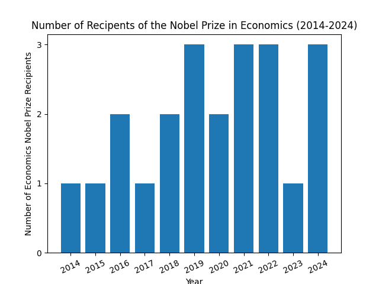

# Project_02: Visualizing Datasets

This repo was created to complete Project 2, the details of which are outlined [here](https://github.com/mikeizbicki/cmc-csci040/tree/2025spring/project_02_visualizing_datasets).

## Graph 1: Number of Recipients of the Nobel Prize in Economics from 2014-2024

I based this graph off of data from this [dataset](https://api.nobelprize.org/v1/prize.json) which I found in this [repo](https://github.com/jdorfman/awesome-json-datasets?tab=readme-ov-file). The graph depicts how many recipients there were in the years 2014-2024 of the Nobel Prize in Economics, or whether the prize was awarded to an individual, a duo, or a trio.
I chose to plot recipients in the field of Economics specifically because it had more interesting variation in the number of recipients every year, as opposed to Chemistry and Literature, which were often awarded to an individual or a trio, respectively, in the chosen decade.

## Graph 2: Number of Vehicles Registered in Montana, 1920 - 1929

I based this graph off of data from this [dataset](https://catalog.data.gov/dataset/motor-vehicle-registrations-dashboard-data). The original dataset counts the amount of automobiles (cars), trucks, buses, and motorcycles in each US state from 1900-2024. With such an abundance of data, I limited the inputs by focusing on the vehicles registered in Montana specifically in the decade 1920-1929. I chose this time period because it displayed the historical increase in access to personal vehicles that took place in this period following WWI. 
